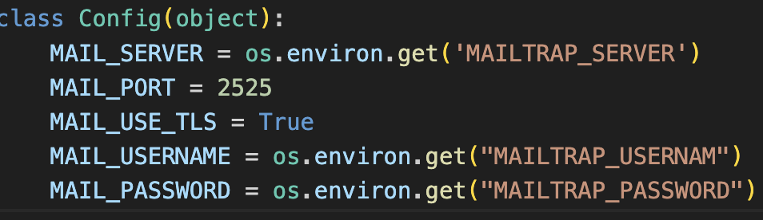
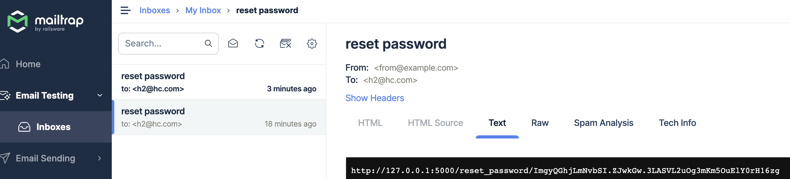
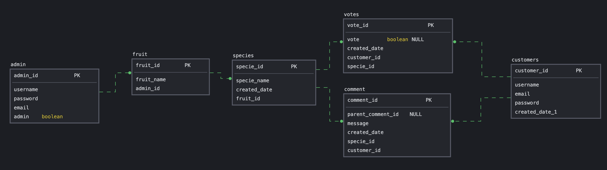

## R1

This fruit voting api can help improve product. By allowing users to provide comments and feedback on fruit flavors, the API enables fruit companies to understand the strengths and weaknesses of their offerings. This feedback can be used to improve existing flavors, create new ones, or identify trends in consumer preferences.

## R2

There are several reasons why the problem needs solving:
1. Market Demand: Understanding consumer preferences and gathering feedback is crucial for businesses operating in the fruit industry. By solving these problems, fruit companies can align their product offerings with market demand, ensuring that they are providing flavors that consumers actually want. This helps to maximize sales and revenue.
2. Product Development: Collecting feedback and comments from users allows fruit companies to gather insights and ideas for improving their existing flavors or creating new ones. By solving these problems, businesses can innovate and develop fruit flavors that better cater to consumer tastes, leading to higher customer satisfaction and increased sales.
3. User Engagement and Satisfaction: Allowing users to vote for flavors and engage in discussions creates a sense of involvement and ownership. It enhances the overall user experience and fosters a community around fruit flavors. By addressing these problems, businesses can build stronger relationships with their customers, leading to increased brand loyalty and advocacy.
4. Data-Driven Decision Making: In today's data-centric world, making informed decisions based on accurate information is crucial for businesses' success. By solving these problems, fruit companies can gather valuable data on consumer preferences, analyze trends, and derive actionable insights. This enables them to make data-driven decisions regarding product development, marketing strategies, and resource allocation.

## R3

The reason to use PostgreSQL is because it's a powerful database management system (RDBMS). It allows to model complex relationships between entities, such as users, fruit species, comments, and votes, which can be useful for organizing and querying the data in a structured manner.

Drawbacks such as its complexity: PostgreSQL can be more complex to set up and administer compared to simpler database solutions. It may require more expertise and resources for maintenance and optimization, especially for larger deployments or complex configurations, and Resource Consumption: PostgreSQL's advanced features and capabilities may consume more system resources, such as memory and CPU, compared to lightweight databases. This can be a consideration if you have limited resources or are targeting a highly scalable environment.

Reference:

Peterson, R. (2019). What is PostgreSQL? Introduction, History, Features, Advantages. [online] Guru99.com. Available at: https://www.guru99.com/introduction-postgresql.html.

## R4

An Object-Relational Mapping (ORM) library, like SQLAlchemy for Flask, provides a way to interact with a relational database using Python objects, thereby bridging the gap between the object-oriented programming paradigm and the relational data model. 

Here are the key functionalities and benefits of using an ORM like SQLAlchemy in Flask:

* Database Configuration: Flask-SQLAlchemy allows you to define the database connection details, such as the database URI, in your Flask application's configuration. This makes it easy to switch between different database engines and configurations by simply modifying the configuration file.

* Object-Relational Mapping (ORM): Flask-SQLAlchemy enables you to define models that represent database tables as Python classes. These models are typically subclasses of the db.Model class provided by Flask-SQLAlchemy. The ORM mapping handles the translation between the Python objects and the underlying database tables, making it easy to interact with the database using familiar Python syntax.

* Database Creation and Migration: Flask-SQLAlchemy provides commands to create the database tables based on the defined models. With a simple command, you can generate the database schema from your models, saving you from manually writing SQL scripts. It also integrates with migration libraries like Flask-Migrate to manage and apply database schema changes over time.

* Querying the Database: Flask-SQLAlchemy simplifies the process of querying the database using SQLAlchemy's query API. You can use the query methods provided by Flask-SQLAlchemy, such as filter(), all(), first(), etc., to construct and execute database queries. These methods generate SQL queries under the hood, allowing you to retrieve, filter, and sort data from the database effortlessly.

* Session Management: Flask-SQLAlchemy handles the management of database sessions for you. It automatically creates and manages a session for each request, ensuring that database operations within a request are handled within a transaction. It simplifies the process of committing or rolling back changes, and you can also explicitly manage sessions when needed.

* Relationship Handling: Flask-SQLAlchemy supports defining relationships between models, such as one-to-one, one-to-many, and many-to-many relationships. It provides methods and attributes to navigate and manipulate these relationships. This simplifies querying related data and makes it easier to work with complex database relationships.

* Integration with Flask: Flask-SQLAlchemy seamlessly integrates with the Flask application, allowing you to access the database throughout your Flask routes and views. It provides a convenient extension that you can initialize and configure in your Flask application, enabling easy access to the database session and ORM functionalities.

Flask-SQLAlchemy simplifies the process of working with databases in Flask applications by providing a convenient and intuitive interface. It handles database configuration, ORM mapping, query generation, session management, and integration with Flask. With Flask-SQLAlchemy, you can focus on building your application's logic and rely on its powerful database functionalities to interact with the database efficiently.

Reference:

Abba, I.V. (2022). What is an ORM – The Meaning of Object Relational Mapping Database Tools. [online] freeCodeCamp.org. Available at: https://www.freecodecamp.org/news/what-is-an-orm-the-meaning-of-object-relational-mapping-database-tools/.

Tran, B. (2020). ORM and SQLAlchemy — The ‘Magic Wand’ in Database Management. [online] Medium. Available at: https://trantriducs.medium.com/orm-and-sqlalchemy-the-magic-wand-in-database-management-a2d02877a57a [Accessed 30 Jun. 2023].

Huls, M. (2022). No Need to Ever Write SQL Again: SQLAlchemy’s ORM for Absolute Beginners. [online] Medium. Available at: https://towardsdatascience.com/no-need-to-ever-write-sql-again-sqlalchemys-orm-for-absolute-beginners-107be0b3148f [Accessed 30 Jun. 2023].

## R5

[Endpoints link](https://documenter.getpostman.com/view/19703585/2s93z9bhp1)

## R7

### 3rd party service:

> Flask-Mail:

Mainly used for user reset password when they forgot password.

init app with flask mail:

```
mail=Mail(app)
```

create three functions:

* generate a token

use itsdangerous package to generate and verify token.

* send email with content having a reset link which invloves the token for verification
in this step use flask-mail implementation,example:
```
from flask_mail import Mail
mail=Mail(app)

....

mail.send(msg)
```
* user click the link, token verify if expire or not, if not then allowed to input new password.

> mailtrap

add app configuration


use to test mail receive;



## R6 & R9

Database models:


ERD:


ADMIN(admin_id, username, email, password)
>admin can create many fruit
FRUIT(fruit_id, fruit_name, admin_id)

>each fruit kind can have many species, fruit created by one admin

SPECIES(specie_id, specie_name, fruit_id )
>each specie belongs to one kind of fruit, and has many votes and species

USER(user_id, username, email, password)
>many users create many votes and comments

VOTES(vote_id, vote_status, user_id, specie_id)
>each vote created by one user, and vote for one specie

COMMENTS(vote_id, parent_comment_id, message, user_id, specie_id)
>each comment create by one user, and comment for one specie, also can be reply for another comment belong to the same specie.

## R8

### Admin model in terms of relationship with fruit

```py
    class Admin(db.Model):
        .....(attributes of model)
        fruit=db.relationship("Fruit", backref="admin", cascade="all, delete")
    class AdminSchema(ma.Schema):
        class Meta:
            fields=("id","username","email","password","fruit")
        
        fruit= fields.List(fields.Nested("FruitSchema"))
```

### Fruit model in terms of relationship with species and admin_id as foreign key

```py
    class Fruit(db.Model):
        ....
        admin_id = db.Column(db.Integer, db.ForeignKey("admin.id"), nullable=False)
        species=db.relationship("Specie", backref="fruits", cascade="all, delete")

    class FruitSchema(ma.Schema):
        ....
        class Meta:
            fields=("id","fruit_name","species","admin_id")
        species= fields.List(fields.Nested("SpecieSchema",exclude=('votes',"comments")))
```
### Specie model in terms of relationship with votes and comments and fruit id as FK

```py
    class Specie(db.Model):
        ....
        fruit_id=db.Column(db.Integer, db.ForeignKey("fruit.id"), nullable=False)
        votes=db.relationship("Vote", backref="species", cascade="all, delete")
        comments=db.relationship("Comment", backref="species", cascade="all, delete")

    class SpecieSchema(ma.Schema):
        ....
        class Meta:
            fields=("id","specie_name","comments","votes")
        
        votes=fields.List(fields.Nested("VoteSchema"))
        comments=fields.List(fields.Nested("CommentSchema"))
```

### User model in terms of relationship with votes and comments
```py
    class User(db.Model):
        ....
        votes=db.relationship("Vote", backref="users", cascade="all, delete")
        comments=db.relationship("Comment", backref="users", cascade="all, delete")

    class UserSchema(ma.Schema):
        ....
        class Meta:
            fields=("id","username","email", "password", "votes","comments")

        votes= fields.List(fields.Nested("VoteSchema", exclude=['user_id',]))
        comments= fields.List(fields.Nested("CommentSchema", exclude=['user_id',]))
```
### Vote model use specie id and user id as FK

```py
    class Vote(db.Model):
        ....
        specie_id=db.Column(db.Integer, db.ForeignKey("species.id"), nullable=False)
        user_id=db.Column(db.Integer, db.ForeignKey("users.id"), nullable=False)
```
### Comment model use specie id and user id as FK

```py
    class Comment(db.Model):
        ....
        specie_id=db.Column(db.Integer, db.ForeignKey("species.id"), nullable=False)
        user_id=db.Column(db.Integer, db.ForeignKey("users.id"), nullable=False)
        
```
## R10

[trello link](https://trello.com/b/5qQxl5lI/apple-flavors-vote)
As plans in trello:
First is to figure out the user stories and then create models. I used an online sqlDB tool called sqldbm to create tables and figure out the relations in between, and then use online diagrams app to build the ERD. It's kind like half work of this project.

The next step is create a new databse in local postgreSQL and connect to flask app.

Then make seperate parts for the app which includes the models and controllers (blueprints). 
There are six models: admin, users, fruit, species, votes, comments.
So admin can CRUD fruits and species, it can also see all users information. It is only allowed to add admin in databse, there's no end point to create admin account.
Fruit and species can only be updated and deleted by admin.
Users need to registe and login to vote and comment, in which used jwt token to avoid duplicate login.
Users can see fruit and species information, include all votes and comments.
Users can CRUD vote and comment, users can reply to each other.

And step before last step is to do error handling in main python file, and add fields validation if necessary.

Last step is to generate end points api by using postman.

## § Instructions

1. git clone this repo

2. install python venv

        python3 -m venv .venv && source .venv/bin/activate 

3. install packages

        python3 -m pip install -r requirements.txt

4. create .env file and set up DATABASE_URL and SECRET_KEY, MAILTRAP_SERVER, MAILTRAP_USERNAME, MAILTRAP_PASSWORD

5. generate models and admin

        flask db create
        flask db seed
    
6. run app

        flask run


